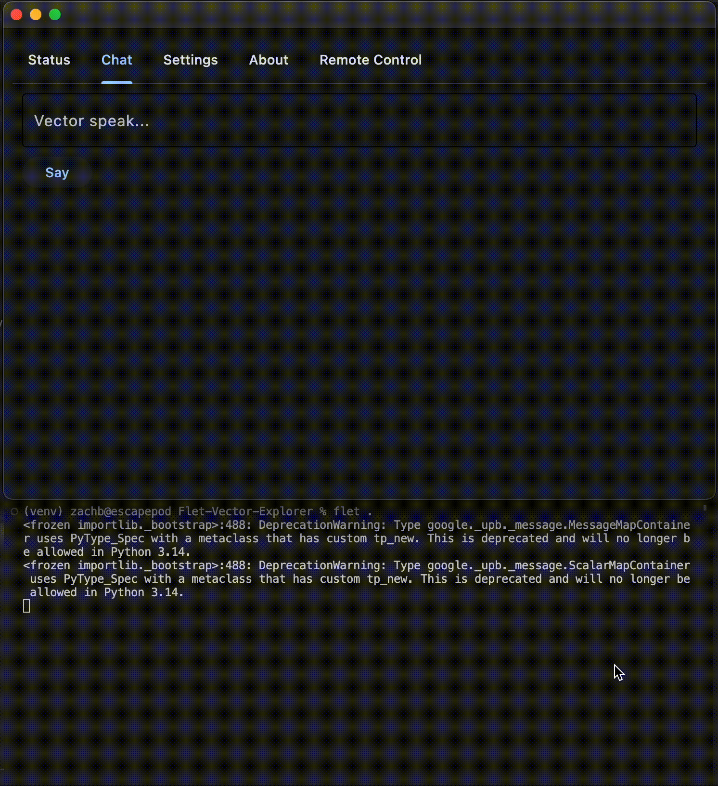
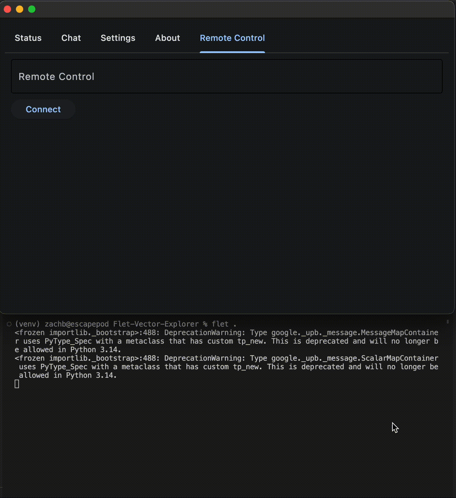

# Vector Explorer (Now in Flet!)

This is a work in progress. Don't use it yet!

This is a fork of the Vector Explorer app, which was itself a fork of the Cosmo explorer. What a wild ride this little robot has gone on.

To run the app:

```
flet run [app_directory]
```

Currently, the only thing that works is the Chat tab, and it only works under very fiddly circumstances. Working on making this virtualizable so it can be deployed as a web app.

### Requirements: 

* the [updated version of the Wirepod Vector SDK*](https://github.com/kercre123/wirepod-vector-python-sdk) from kercre123. This is required to run the app; running the original SDK doesn't work well (much at all as far as I can tell)
* a wirepod-enabled Vector robot 

### How To Set This Up

I haven't gotten this to run on hardware other than my own yet, so your mileage may vary. Let's play with it together if it doesn't work on your machine.

#### Steps

1. git clone
2. make a Python venv
3. install the requirements from `requirements.txt` into that venv
4. source venv
5. `flet .`

### What works So Far

#### Chat



#### Remote Control

